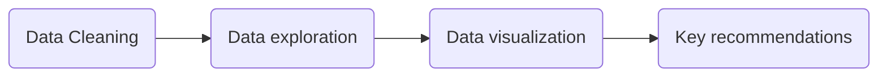

# [Maven-Churn-Telecomn-Churn-Telecom](https://mavenanalytics.io/challenges/maven-churn-challenge/8b3b32ff-fb5b-43ff-9fbf-c11f30ee14fe)

## 🌐INTRODUCTION
Trong dự án này, tôi trình bày phân tích và trực quan hóa các chi tiết nhân khẩu học và thông tin tài khoản chính của 7,043 khách hàng tại California của Maven Communications. Dữ liệu bao gồm thông tin về nhân khẩu học, địa điểm, thời gian thuê bao, dịch vụ bổ sung và trạng thái của từng khách hàng, được trình bày chi tiết hơn tại Maven Analytics.

Mục đích của phân tích này là để hiểu tỷ lệ rời bỏ dịch vụ (churn rate) và những yếu tố chính ảnh hưởng đến thống kê này. Tôi sẽ đạt được điều này thông qua việc phân khúc khách hàng (dựa trên giá trị tiền tệ và lòng trung thành), và phân tích các chỉ số chính làm tăng rủi ro rời bỏ. Dựa trên các phát hiện này, tôi sẽ đưa ra các khuyến nghị để giảm tỷ lệ rời bỏ và cải thiện việc giữ chân khách hàng.

Tôi đã sử dụng SQL Server cho toàn bộ phân tích và Power BI cho việc trực quan hóa. Các bước chính của dự án được phác thảo dưới đây:

## 🌟 Project Goals
Dự án Maven Churn Telecom đang đối mặt với thách thức nghiêm trọng về tỷ lệ khách hàng rời bỏ cao. Điều này dẫn đến tổn thất doanh thu đáng kể và ảnh hưởng đến lợi nhuận cũng như sự tăng trưởng tổng thể của công ty.

Việc hiểu rõ nguyên nhân gốc rễ của hiện tượng khách hàng rời bỏ là rất quan trọng. Dự án đặt mục tiêu xác định các yếu tố chính dẫn đến sự suy giảm khách hàng, chẳng hạn như chất lượng dịch vụ kém, hỗ trợ khách hàng không đủ hoặc các vấn đề về giá cả.

Sau khi được xác định, những yếu tố này sẽ tạo cơ sở cho việc phát triển các chiến lược cụ thể nhằm giảm tỷ lệ khách hàng rời bỏ và cải thiện khả năng giữ chân khách hàng. Điều này bao gồm cải thiện dịch vụ, nâng cao cơ chế hỗ trợ khách hàng và có thể điều chỉnh các gói giá.

## Dashboard trong Power BI
### 👨‍🦲Overview

### 🏃Churner

### 🖋️Cusomer Subscriptions

### 💸Charge

### 🗺️Internet Service

### 📱Phone-Streaming Service

## 🔑Insight
Từ góc độ khách hàng:
- Giới tính không ảnh hưởng mạnh đến tỷ lệ rời bỏ dịch vụ.
- Người cao tuổi có xu hướng rời bỏ dịch vụ nhiều hơn so với nhóm trẻ hơn.
- Khách hàng không có liên lạc thường xuyên có tỷ lệ rời bỏ cao.
- Khách hàng mới gia nhập với thời gian thuê bao dưới 0,5 năm không ổn định và có khả năng rời bỏ cao.
- Khách hàng giới thiệu ít hơn 4 người có khả năng rời bỏ cao hơn.
Từ góc độ dịch vụ:
- Dịch vụ điện thoại không ảnh hưởng nhiều đến tỷ lệ rời bỏ.
- Khách hàng có xu hướng rời bỏ khi sử dụng dịch vụ Internet cáp quang, có thể do chất lượng kết nối kém hoặc tài nguyên lạc hậu.
- Cung cấp các gói bảo mật trực tuyến, sao lưu trực tuyến, bảo vệ thiết bị và hỗ trợ kỹ thuật cao cấp có thể giúp giữ chân khách hàng.
- Khách hàng có xu hướng ở lại nếu họ được cung cấp các ưu đãi khuyến mại, trong khi ưu đãi E là ít hấp dẫn nhất để giữ khách hàng.
- Có khả năng cao rời bỏ nếu khách hàng chọn hợp đồng theo tháng.
Từ góc độ thanh toán:
- Một tỷ lệ lớn khách hàng sử dụng hoá đơn không giấy rời bỏ dịch vụ.
- Khách hàng thanh toán hoá đơn qua ngân hàng và thư tín có khả năng rời bỏ cao.
- Khách hàng trả tiền cao, phần lớn đăng ký dịch vụ cáp quang, có khả năng rời bỏ cao hơn.
## 🔆Suggestions
- Tăng cường ưu đãi cho hợp đồng dài hạn:Cung cấp giảm giá hoặc khuyến mãi đặc biệt cho khách hàng chuyển từ hợp đồng tháng sang hợp đồng 1-2 năm. Điều này giúp gia tăng sự cam kết và giảm tỷ lệ rời bỏ.
- Cải thiện giá trị cho nhóm chi phí cao: Đối với khách hàng có chi phí trên $70/tháng, cần đưa ra các gói ưu đãi dịch vụ bổ trợ miễn phí (như bảo mật trực tuyến, hỗ trợ thiết bị) để tăng sự hài lòng và cảm giác giá trị.
- Khuyến khích sử dụng dịch vụ bổ trợ: Đẩy mạnh chiến lược cross-selling để khách hàng thấy được lợi ích khi sử dụng các dịch vụ như Online Backup, Tech Support. Có thể thực hiện thông qua các gói combo giảm giá hoặc thời gian dùng thử miễn phí.
- Nâng cao trải nghiệm Internet Fiber Optic: Đối với khách hàng sử dụng Fiber Optic, cần cải thiện chất lượng dịch vụ (đặc biệt về tốc độ, độ ổn định), đồng thời triển khai các chính sách giá ưu đãi để giữ chân khách hàng.
- Thúc đẩy thanh toán tự động: Khuyến khích khách hàng sử dụng thanh toán tự động qua thẻ tín dụng hoặc tài khoản ngân hàng bằng cách cung cấp giảm giá cho hóa đơn thanh toán tự động hoặc ưu đãi độc quyền cho nhóm này.
- Tập trung vào nhóm khách hàng dễ rời bỏ:Tăng cường chăm sóc khách hàng cá nhân hóa đối với các nhóm có nguy cơ cao (chi phí cao, không sử dụng dịch vụ bổ trợ, hợp đồng tháng). Thực hiện các chương trình khảo sát hài lòng định kỳ để giải quyết kịp thời vấn đề của họ.

## 📖Nguồn tài liệu tham khảo: 
- Playlist "End to End Data/Business Analytics Project (Power BI)" của Satyajit Pattnaik trên YouTube, bao gồm các video hướng dẫn phân tích dữ liệu từ dự án Maven Pizza Challenge. [Link](https://github.com/pik1989/ChurnAnalysisProject-PowerBI/)

